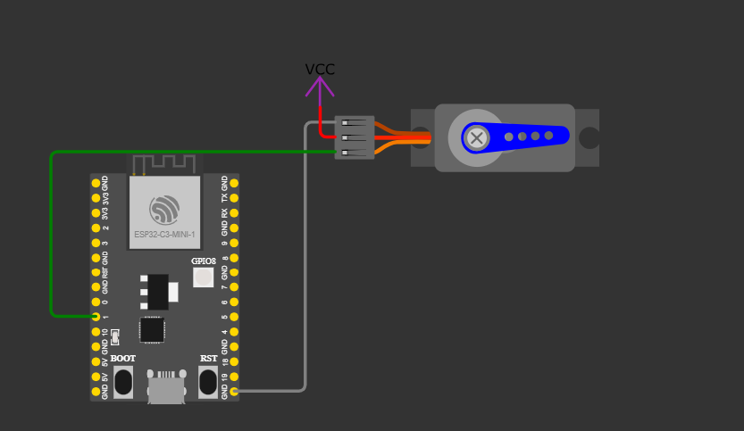
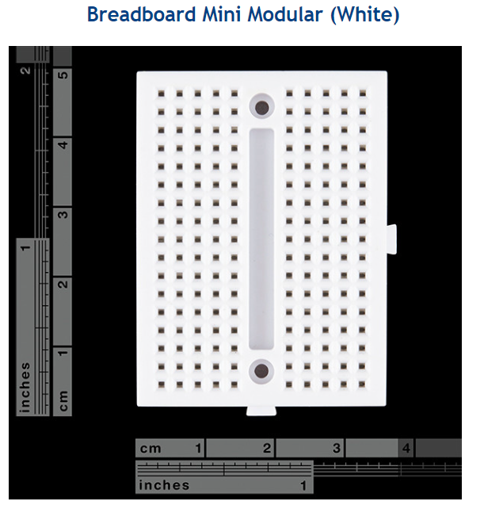
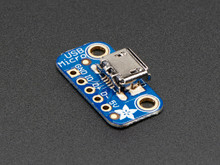
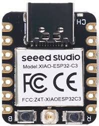
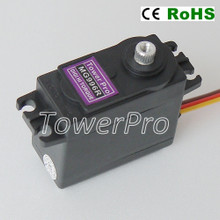
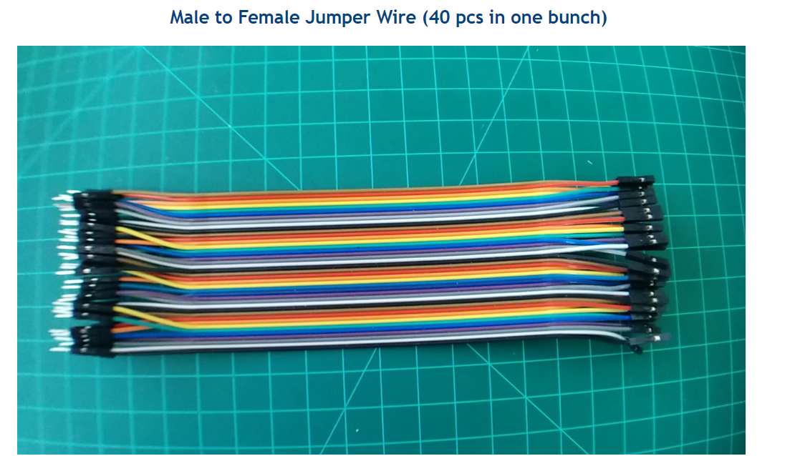
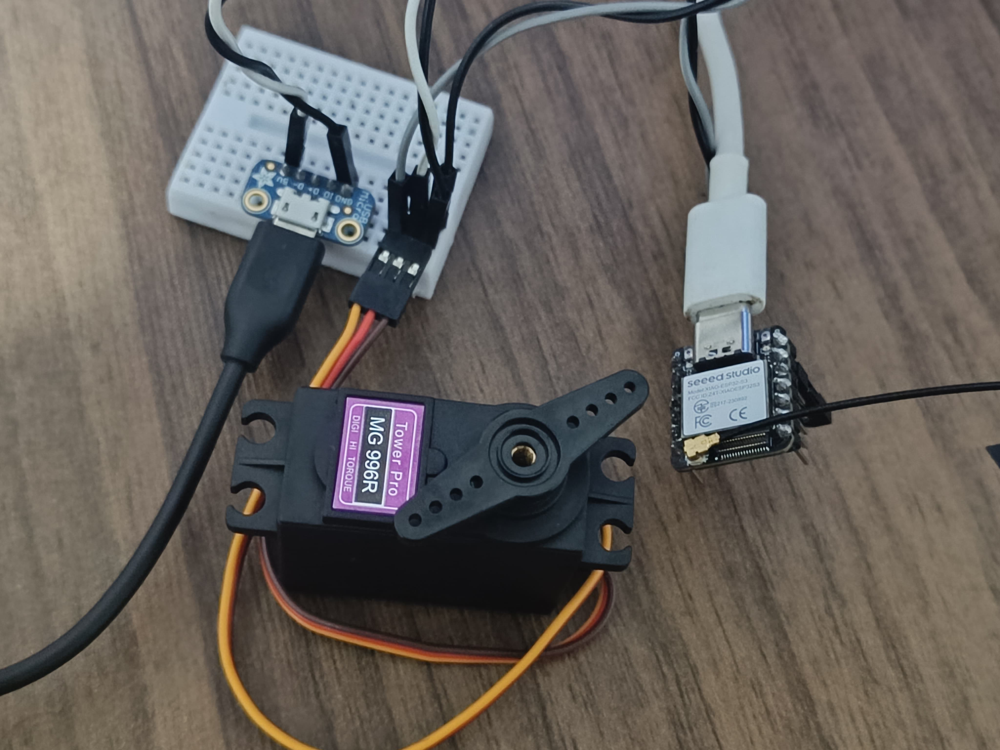
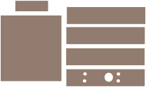
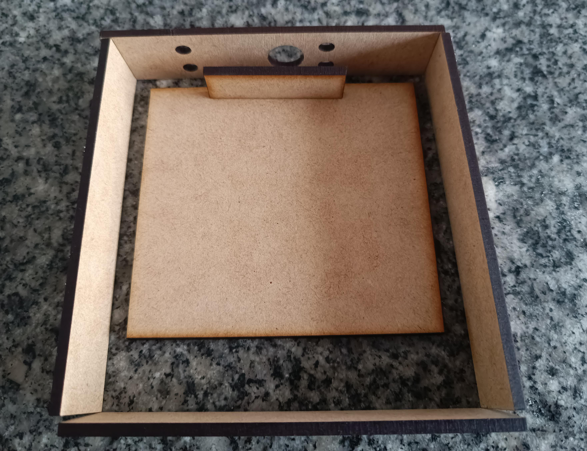
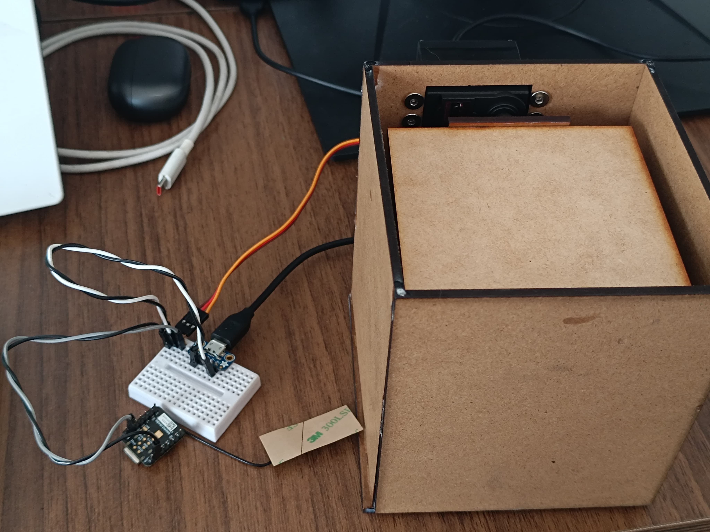

# SmartBin Hardware 

## Overview
This section will demonstrate the construction process for electronics and structural materials.

## First Iterarion 

## Circuit design 
I will begin by connecting the servo to the Xiao ESP32-C3 MCU using a breadboard, and then linking the servo to laser-cut pieces.
 
[wokwi design](https://wokwi.com/projects/397272562672190465)
 
  

## Materials
To build the Object Classifier, I'll need the following hardware components. Visual references for each part are provided below.
<table>
<tr>
    <td>
         
        <strong>Breadboard</strong>
    </td>
    <td>
         
        <strong>USB Micro-B Breakout Board</strong>
    </td>
</tr>
<tr>
    <td>
         
        <strong>Xiao esp32 c3</strong>
    </td>    <td>
         
        <strong>Metal servo motor</strong>
    </td>
</tr>
<tr>
    <td>
         
        <strong>Jumper Wires</strong>
    </td>
</tr>
</table>

## Circuit result
This circuit successfully changes the angle of the servo motor.
 
 

## Laser cut design
I will use laser cutting because it's cheap and fast, perfect for 2D prototyping.

## Laser designed parts
These parts are supposed to hold the servo and use servo movement to classify in 2 categories.
 

## Laser parts result
In this initial attempt, I successfully used the servo motor as a classifier, but the space designed to hold the servo with screws is too small. It will need slight adjustment.
 
 

## Second Iterarion 
In this iteration, the laser-cut parts needed for the classification part of the system were completed, and the servo mount now fits in this attempt.
 
[LaserCutDesign.stl](Design/LaserCut/LaserClassifier.stl)
 
 
