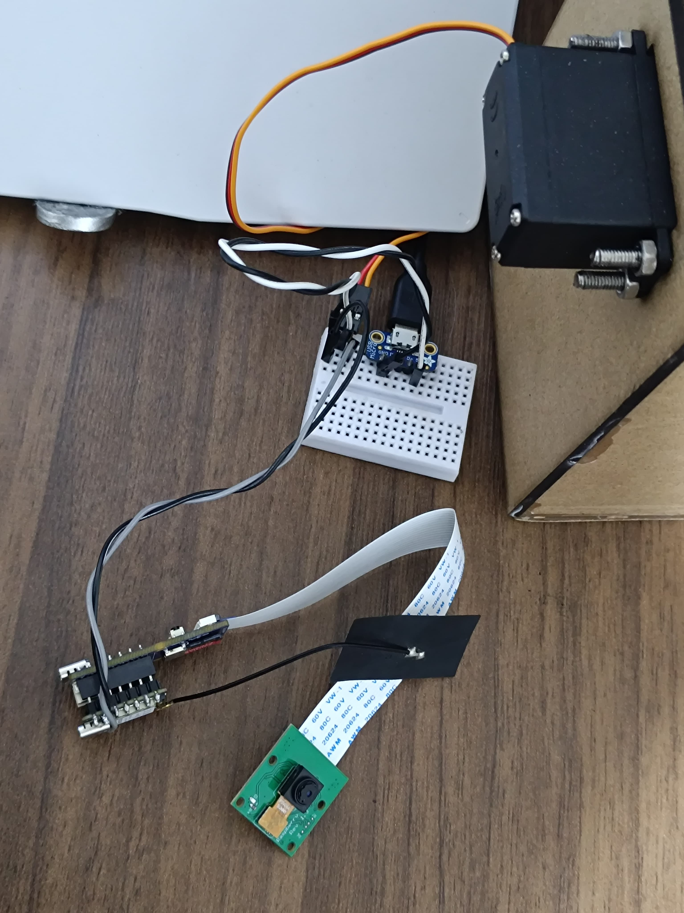

# Hardware 

## Overview
This section will demonstrate the construction process for electronics and structural materials.

## First Iterarion 

## Circuit design 
I will begin by connecting the servo to the Xiao ESP32-C3 MCU using a breadboard, and then linking the servo to laser-cut pieces.
 
[wokwi design](https://wokwi.com/projects/397272562672190465)
 
  

## Materials
To build the Object Classifier, I'll need the following hardware components. Visual references for each part are provided below.
<table>
<tr>
    <td>
         
        <strong>Breadboard</strong>
    </td>
    <td>
         
        <strong>USB Micro-B Breakout Board</strong>
    </td>
</tr>
<tr>
    <td>
         
        <strong>Xiao esp32 s3 sense</strong>
    </td>    <td>
         
        <strong>Metal servo motor</strong>
    </td>
</tr>
<tr>
    <td>
         
        <strong>Jumper Wires</strong>
    </td>
</tr>
</table>

## Circuit result
This circuit successfully changes the angle of the servo motor.
 
 

## Laser cut design
I will use laser cutting because it's cheap and fast, perfect for 2D prototyping.

## Laser designed parts
These parts are supposed to hold the servo and use servo movement to classify in 2 categories.
 

## Laser parts result
In this initial attempt, I successfully used the servo motor as a classifier, but the space designed to hold the servo with screws is too small. It will need slight adjustment.
 
 

## Second Iterarion 
In this iteration, the laser-cut parts needed for the classification part of the system were completed, and the servo mount now fits in this attempt.
 
[LaserCutDesign.stl](https://github.com/LeonelCamposM/SmartBin/blob/main/Design/LaserCut/LaserClassifier.stl)
 
 

## Third Iterarion 
In this iteration the vision system will be designed and built, also i will try to expose an interface between the vision system and the classifier system.

## Materials
To build the Vision system, I'll need the following hardware components. Visual references for each part are provided below.
<table>
<tr>
    <td>
         
        <strong>Xiao esp32 s3 sense</strong>
    </td>
     <td>
         
        <strong>Grove Vision AI V2.</strong>
    </td>
</tr>
<tr>
</tr>
<tr>
     <td>
         
        <strong>Grove Camera</strong>
    </td>
</tr>
</table>

## Wiring diagram
In this case, the interface between the vision system and the classifier system will be the microcontroller, using the I2C communication protocol to read the AI sensor output and activate the servo motor using the PWM output on pin D1.
 
 

## Real circuit
I decided to use the ESP32-S3 because the D1 pin of the Xiao ESP32-C3 wasn't working with my servo. So, I decided to continue using the ESP32-S3.

The Grove board female headers provide the I2C interface. I also soldered two jumper wires on top of the D1 and GND pins to use them at the same time as I'm using the Grove AI V2 connector.

Click this image to watch a demo of the circuit tuning a custom model for e-waste classification:
 

