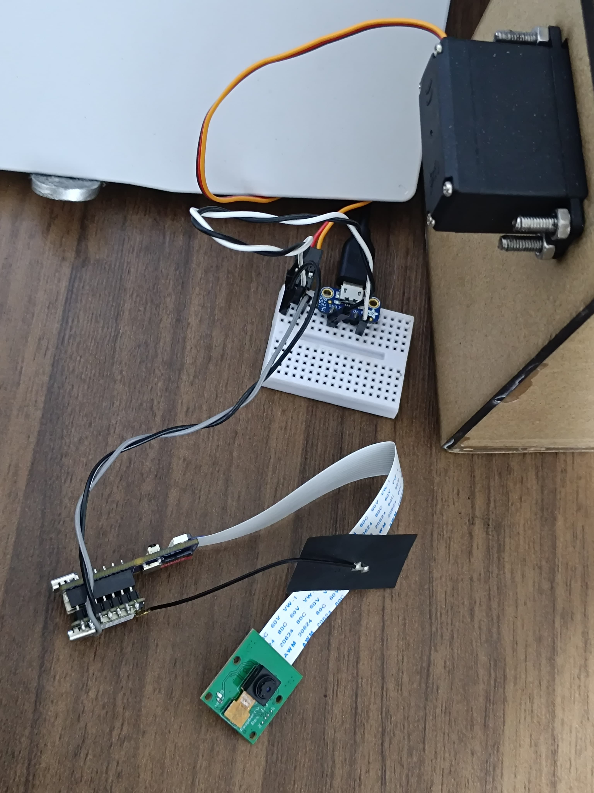

# Electronics Trash Classifier

## Project Overview
This project aims to create a smart bin capable of classifying and sorting waste using an AI sensor. The smart bin will help in automating the recycling process, making waste management more efficient.
 
</a>

## Key Features
- **AI-Based Sorting**: Utilizes an AI sensor to accurately classify and sort different types of waste.
 

 

- **Automation**: Automates the recycling process, reducing the need for manual sorting. Click the image to wacth the video.

- **User-Friendly Design**: Incorporates 3D conceptual models and laser-cut parts, making it easy and cheap to build and learn.
<table>
  <tr>
    <td></td>
    <td></td>
  </tr>
</table>

## Documentation index
- **Design**
The development process involved three iterations: adapting the 3D conceptual model to incorporate a servo motor, completing laser-cut parts for the classification system, and creating a custom classification model for different types of electronic waste.
[Design](./Design)
 

- **Documentation**
This section shows the step-by-step instructions and the progress made during each phase of the project.
[Hardware Components](./Hardware)
[Software Components](./Software)
 

- **Execution instructions**
Follow this guide to run the application.
<a href="/SETUP.md">Setup Instructions</a>
 