# Software-Image classification 

## Overview
This section will describe the construction process for used software and ML models.

## First Iteration
Used wiring diagram and base code
changed servoPin to 2 (D1 pin xiao-esp32S3)
[Workwiki Simulation](https://wokwi.com/projects/360939448028148737)

## Second Iteration
I successfully followed this post to in order to learn how to design and deploy a custom ML classification model into the Groove AI V2.
<br>
[Read the post here](https://www.hackster.io/mjrobot/computer-vision-at-the-edge-with-grove-vision-ai-module-v2-0003c7)
<br>
<br>
<br>

## Third Iteration
The next step will be to create my own classification model to classify different kinds of electronic trash and deploy it into the AI vision sensor.
<br>

## Base image classification model
This model was built in order to have a very simplified version trained to classify wires, batteries, and background.

https://studio.edgeimpulse.com/public/398417/live

- **Dataset creation**
Involves gathering and preparing a collection of images representing different types of electronic trash for training the model. I used my phone to collect the data.
<br>
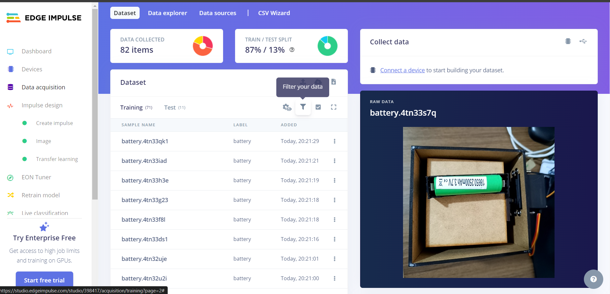<br>
<br>

- **Impulse design**
Refers to the configuration of the Edge Impulse project, including selecting the model architecture and setting training parameters.
<br>
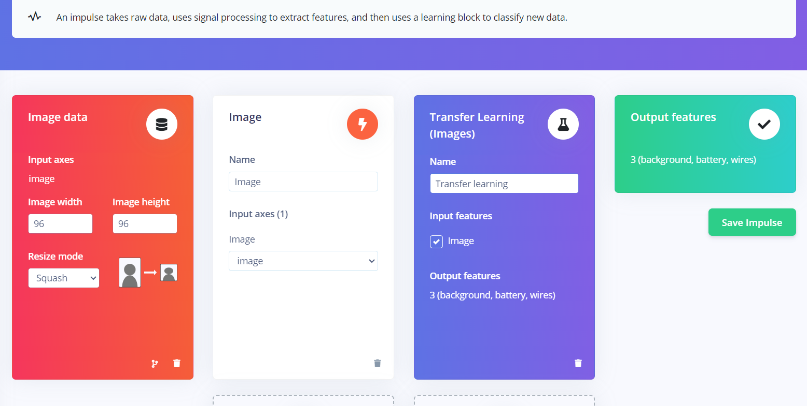<br>
<br>

- **Impulse design/Feature generation**
Involves extracting relevant features from the images to be used as input for the model.
<br>
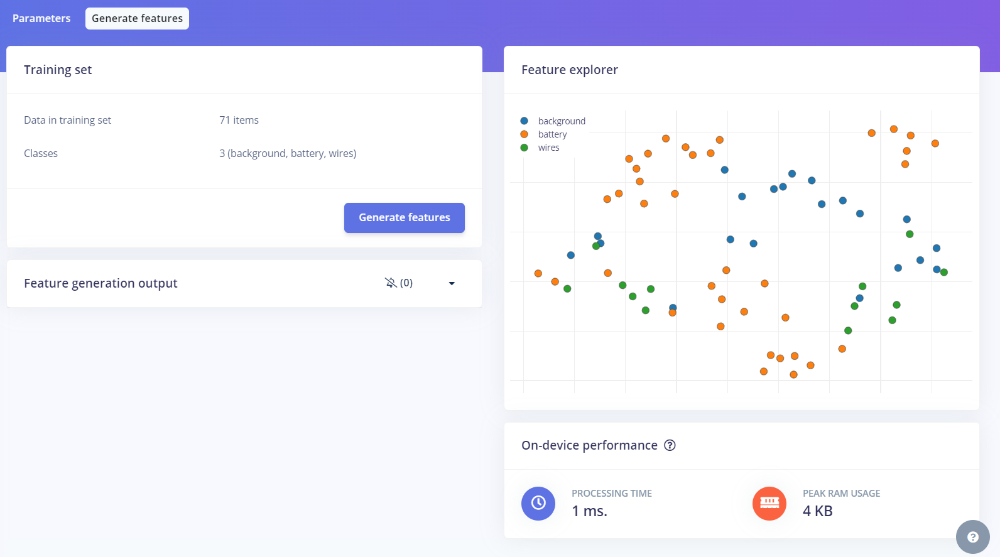<br>
<br>

- **Impulse design/Transfer learning**
Utilizes pre-trained models to expedite the training process by leveraging knowledge from models trained on similar tasks.
In this case i will use MobileNetv2 model architecture.
<br>
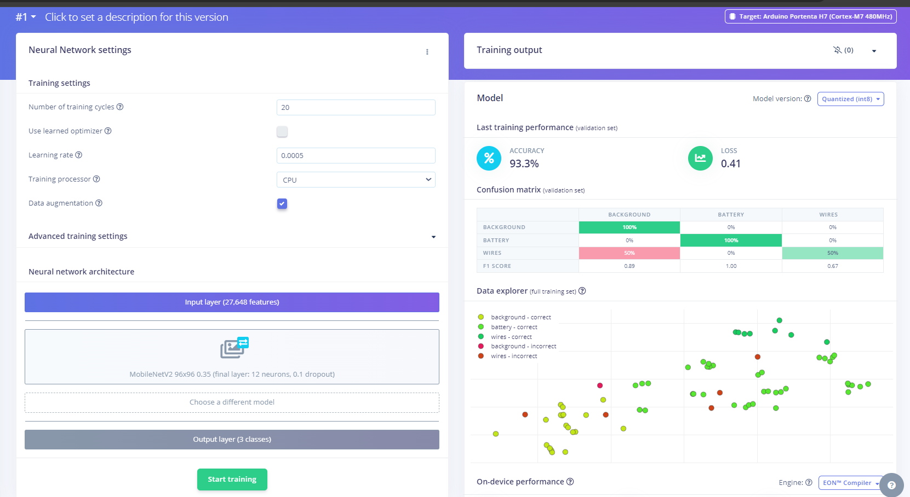<br>
<br>

- **Model Testing**
Evaluates the performance of the trained model using a separate set of test images to ensure its accuracy and effectiveness.
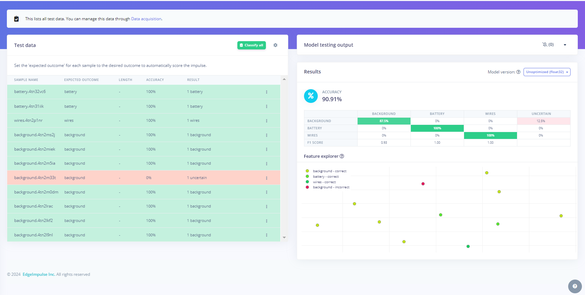<br>

- **Dashboard/Download block output**
Using int8 (8-bit integer) format for microcontrollers (MCUs) is beneficial because it significantly reduces the memory and computational requirements compared to higher precision formats like float32 (32-bit floating point).
<br>
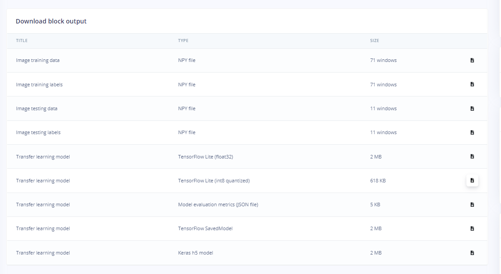<br>
<br>

- **GoogleColab**
In this step the Edge impulse int8 model will be converted to make it compatible with the AI vision sensor

1) Install vela 
```shell
!pip install ethos-u-vela
!!vela --version
```

<br>
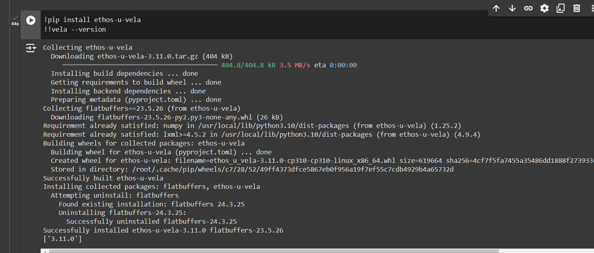<br>
<br>

2) Upload the model
<br>
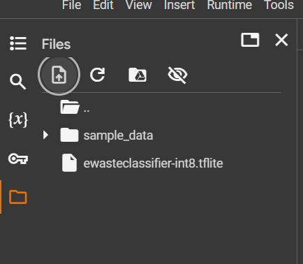<br>
<br>

3) Optimize and download the model
```shell
!vela ewasteclassifier-int8.tflite --accelerator-config ethos-u55-64
```
Result will be in Output directory
<br>
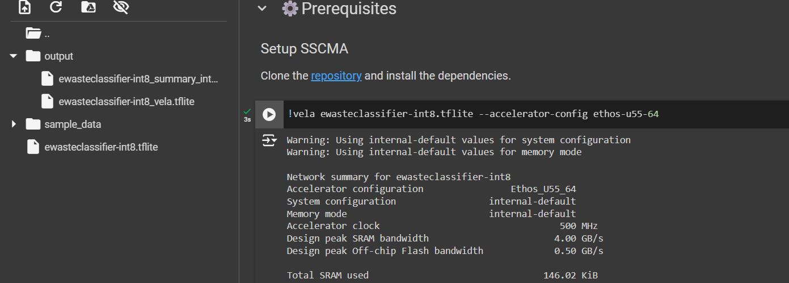<br>
<br>

- **Sense Craft**
New model added to Sense Craft platform, at this point the model can be uploaded to the device in the same way as the example models
<br>
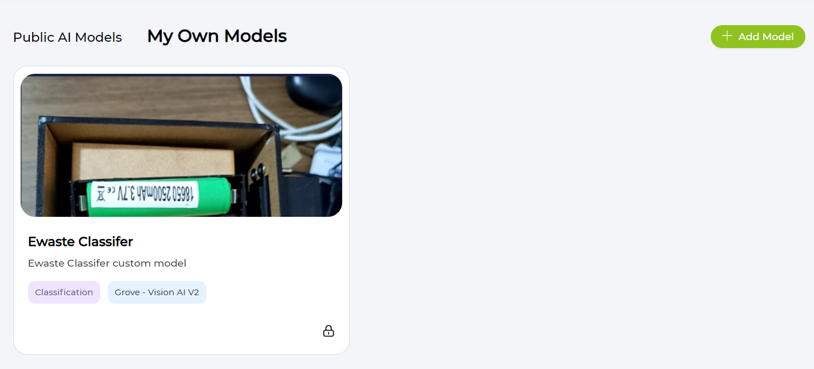<br>
<br>
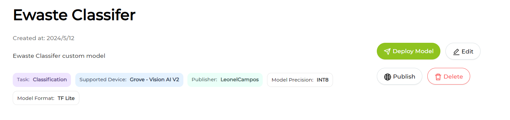<br>
<br>
